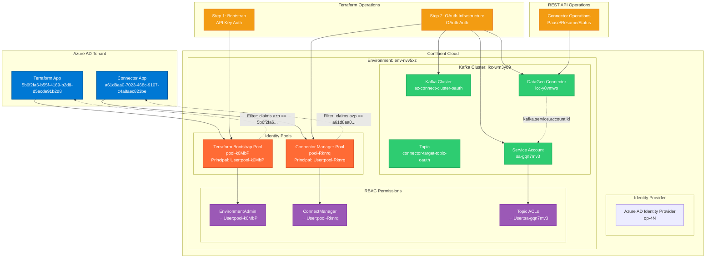
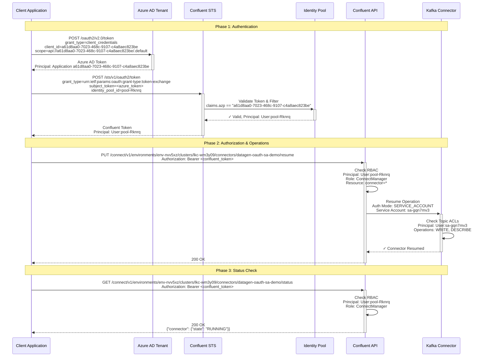
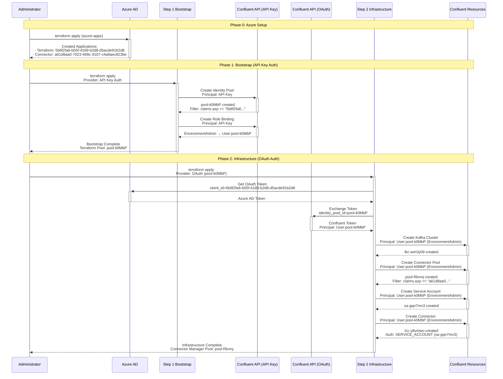
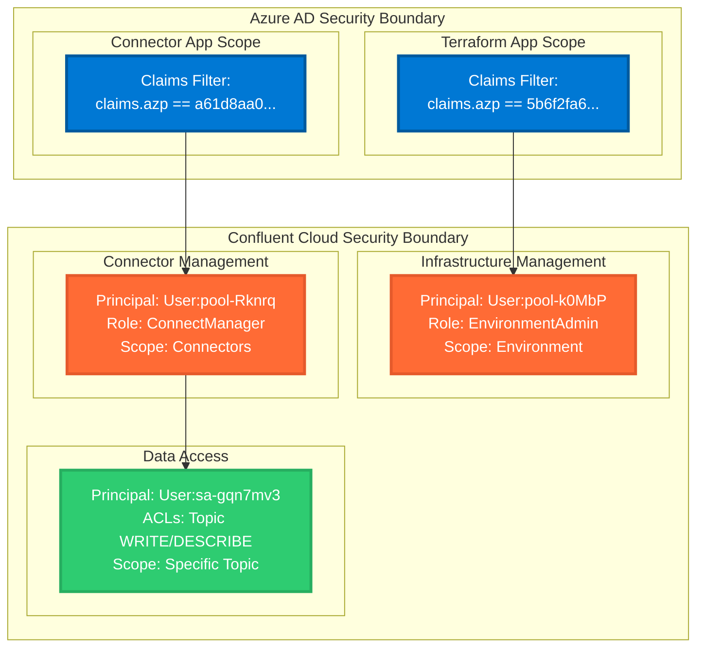

# Architecture Diagrams

## Component/Resource Diagram

## Interaction Diagram - OAuth Authentication Flow

## Two-Phase Terraform Deployment Flow

## Principal Authorization Matrix

| Operation | Principal | Role/Permission | Resource Pattern |
|-----------|-----------|-----------------|------------------|
| **Terraform Bootstrap** | User:pool-k0MbP | EnvironmentAdmin | env-nvv5xz |
| **Connector Management** | User:pool-Rknrq | ConnectManager | connector=* |
| **Topic Operations** | User:sa-gqn7mv3 | Topic ACLs | connector-target-topic-oauth |
| **Cluster Operations** | User:sa-gqn7mv3 | Cluster ACLs | lkc-wm3y09 |
| **Consumer Groups** | User:sa-gqn7mv3 | Group ACLs | connect-* |

## Security Boundaries

